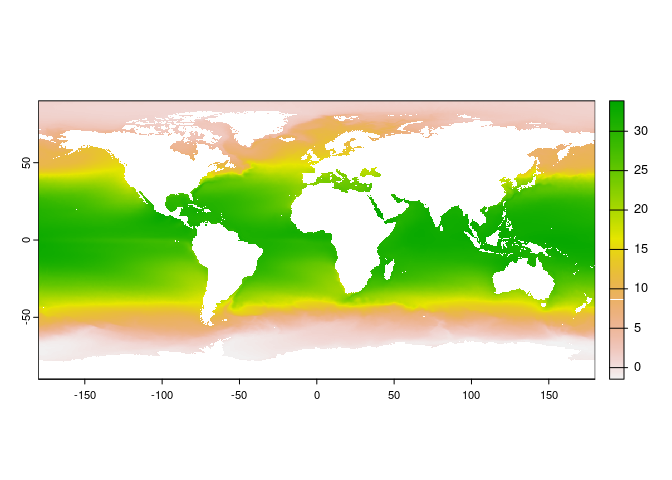
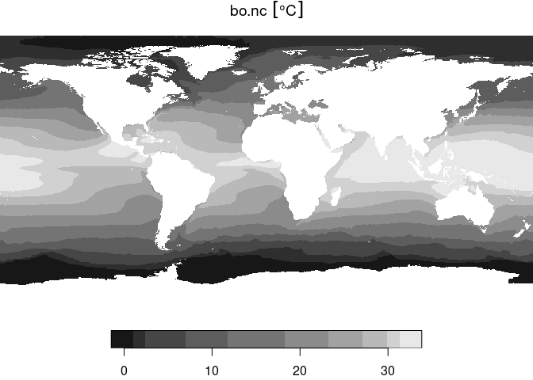

<!-- README.md is generated from README.Rmd. Please edit that file -->

# Transform Bio-Oracle NetCDF files into GeoTIFF

<!-- badges: start -->
<!-- badges: end -->

Bio-Oracle layers are natively developed in NetCDF format. This short
tutorial shows how to turn into GeoTIFF in R and Python.

As an example, we will download the [surface Ocean Temperature layer
from Bio-Oracle](https://bio-oracle.org/downloads-to-email-v3.php),
predicted for the decade of 2090 to 2100 using the Shared Socioeconomic
Pathway scenario ssp585. Here below you can find a direct link to
download.

[**Download Bio-Oracle Ocean Temperature
Layer**](https://erddap.bio-oracle.org/erddap/griddap/thetao_ssp585_2020_2100_depthsurf.nc?thetao_mean%5B(2090-01-01):1:(2090-01-01T00:00:00Z)%5D%5B(-90.0):1:(90.0)%5D%5B(-180.0):1:(180.0)%5D)

Save the layer in a folder named `data` and name it as `bo.nc`.

# NetCDF to GeoTIFF in R

There are several ways of turning a NetCDF file into GeoTIFF. Here we
show how to do it with two of the most common packages for dealing with
raster data.

## Using terra

``` r
# Install required package
# You can install them using: install.packages("terra")
library(terra)
#> terra 1.7.55

# Path to the Bio-Oracle layer file
nc_path <- "./data/bo.nc"

# Read layer
bo <- rast(nc_path)

# Inspect file
bo
#> class       : SpatRaster 
#> dimensions  : 3600, 7200, 1  (nrow, ncol, nlyr)
#> resolution  : 0.05, 0.05  (x, y)
#> extent      : -180, 180, -90, 90  (xmin, xmax, ymin, ymax)
#> coord. ref. : lon/lat WGS 84 
#> source      : bo.nc 
#> varname     : thetao_mean (Average OceanTemperature) 
#> name        : thetao_mean 
#> unit        :    degree_C 
#> time        : 2090-01-01 UTC

# Plot
plot(bo)
```

<!-- -->

``` r

# Write as GeoTIFF
writeRaster(bo, "./data/bo_terra.tif")
```

## Using stars

``` r
# Install required package
# You can install them using: install.packages("stars")
library(stars)
#> Loading required package: abind
#> Loading required package: sf
#> Linking to GEOS 3.10.2, GDAL 3.4.1, PROJ 8.2.1; sf_use_s2() is TRUE

# Path to the Bio-Oracle layer file
nc_path <- "./data/bo.nc"

# Read layer
bo <- read_stars(nc_path)

# Inspect file
bo
#> stars object with 3 dimensions and 1 attribute
#> attribute(s), summary of first 1e+05 cells:
#>                 Min.   1st Qu.  Median     Mean 3rd Qu.     Max.
#> bo.nc [°C] 0.8729433 0.9850401 1.13016 1.158159 1.32125 1.593663
#> dimension(s):
#>      from   to         offset delta  refsys x/y
#> x       1 7200           -180  0.05      NA [x]
#> y       1 3600             90 -0.05      NA [y]
#> time    1    1 2090-01-01 UTC    NA POSIXct

# Plot
plot(bo)
#> downsample set to 7
```

<!-- -->

``` r

# Write as GeoTIFF
write_stars(bo, "./data/bo_stars.tif")
```

# NetCDF to GeoTIFF in Python

``` python
# Install required packages
# You can install them using: pip install xarray rioxarray matplotlib
import xarray as xr
import rioxarray
import matplotlib.pyplot as plt

# Path to the Bio-Oracle layer file
nc_path = "./data/bo.nc"

# Read layer
bo = xr.open_dataset(nc_path)
#> /usr/lib/python3/dist-packages/scipy/__init__.py:146: UserWarning: A NumPy version >=1.17.3 and <1.25.0 is required for this version of SciPy (detected version 1.26.2
#>   warnings.warn(f"A NumPy version >={np_minversion} and <{np_maxversion}"

# Inspect file
print(bo)
#> <xarray.Dataset>
#> Dimensions:      (time: 1, latitude: 3600, longitude: 7200)
#> Coordinates:
#>   * time         (time) datetime64[ns] 2090-01-01
#>   * latitude     (latitude) float32 -89.97 -89.93 -89.88 ... 89.88 89.93 89.97
#>   * longitude    (longitude) float32 -180.0 -179.9 -179.9 ... 179.9 179.9 180.0
#> Data variables:
#>     thetao_mean  (time, latitude, longitude) float64 ...
#> Attributes: (12/39)
#>     cdm_data_type:                             Grid
#>     comment:                                   Uses attributes recommended by...
#>     Conventions:                               CF-1.5
#>     creator_name:                              Bio-Oracle consortium: https:/...
#>     creator_url:                               https://www.bio-oracle.org
#>     Easternmost_Easting:                       179.975
#>     ...                                        ...
#>     standard_name_vocabulary:                  CF Standard Name Table v70
#>     summary:                                   Uses attributes recommended by...
#>     time_coverage_end:                         2090-01-01T00:00:00Z
#>     time_coverage_start:                       2090-01-01T00:00:00Z
#>     title:                                     Bio-Oracle OceanTemperature [d...
#>     Westernmost_Easting:                       -179.975

# Extract the variable data that you want to convert to GeoTIFF
variable_data = bo["thetao_mean"]

# Plot
variable_data.plot()
plt.show()
```


``` python

# Write as GeoTIFF using rioxarray
variable_data.rio.to_raster("./data/bo_xarray.tif")
```
